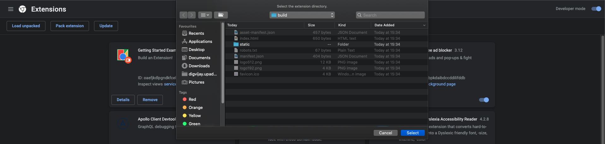
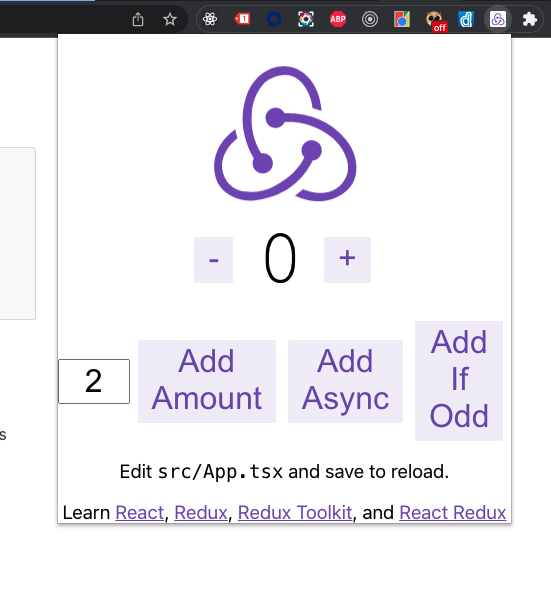

## How to run on your machine

In order to use this plugin simply run
```
npm run build
```


Then go to the Window > Extensions in the chrome application menu.

Make sure Developer Mode is enabled.

Click on `Load unpacked` and select the build folder.



and the extension should now be installed.


## How does it look?



## Notes
For more details pls refer to this [link](https://developer.chrome.com/docs/extensions/mv3/getstarted/)

